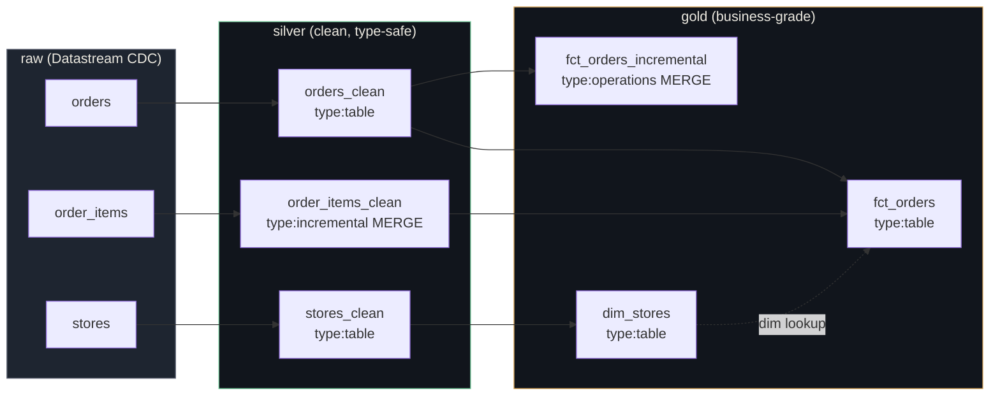

# dataform-bigquery-pipeline-pattern

> Pattern repository for migrating BigQuery analytics pipelines from ad-hoc Scheduled Queries to a versioned, DAG-driven, **Pipeline-as-Code** architecture using Dataform.

This repo demonstrates the architectural pattern behind a real production migration of a multi-country food-service analytics pipeline (under NDA): **91 SQLX files, 165 hardcoded references converted to `${ref()}`, a 7-phase DAG, and an A/B/C/D validation pattern that proves parity before any production change.**

The volumes, business rules, and table names below are sanitized — but the orchestration model, validation discipline, and folder layout are faithful to the real system.

---

## Why this repo exists

Most BigQuery analytics pipelines start the same way: someone schedules a query in the BigQuery console. That query joins another table that was scheduled by someone else, six months earlier. Six months later, nobody remembers the dependency order, costs are creeping, and a typo in one CTE breaks a downstream dashboard silently.

This repo shows **the upgrade path** from "scheduled queries hidden in a UI" to:

- Every transformation in **Git**, with PR review.
- An **explicit DAG** (Dataform resolves execution order automatically via `${ref()}`).
- **Incremental loads** validated *before* any production change, using a four-step simulation pattern.
- **Workflow configurations** as code (cron schedules, tags, environments).
- **CI compilation** so a broken SQL never reaches production.

It is opinionated. It reflects a real migration that paid for itself in reduced cost and reduced incident frequency within one quarter.

---

## Architecture



The DAG above is **resolved automatically by Dataform** — there is no `airflow_dag.py` to maintain, no manual ordering, no "which query runs first" discussion. Every `${ref("table")}` is a declared edge.

---

## What's in this repo (and what's not)

**In:**
- Full Dataform project skeleton (`workflow_settings.yaml`, `package.json`, `definitions/`)
- Three layers: `sources/` (declarations), `silver/`, `gold/` — including one **incremental MERGE** with `uniqueKey` + `updatePartitionFilter`
- Reusable **JS includes** for cross-project helpers (timezone, currency conversion)
- The **A/B/C/D validation queries** that gate every incremental migration
- Two **Python utility scripts** to bootstrap a migration from existing SQL
- **CI workflow** that compiles the Dataform project on every PR
- **Docs** explaining the philosophy, the validation pattern, and the alternatives rejected (Airflow, dbt)

**Not in:**
- Production credentials, real GCP project IDs, real table names
- Business logic specific to the original company (revenue recognition rules, tax models, compliance flags)
- The 91 actual SQLX files — only representative samples
- The complete LookML semantic layer that consumes the gold tables ([see separate repo](https://github.com/guilhermeantoniacomi/lookml-fanout-symmetric-aggregates))

---

## Quick start

```bash
# 1. Clone
git clone https://github.com/guilhermeantoniacomi/dataform-bigquery-pipeline-pattern.git
cd dataform-bigquery-pipeline-pattern

# 2. Generate mock data and load to your own BigQuery project
python scripts/generate_mock_data.py --project YOUR_GCP_PROJECT --dataset raw

# 3. Edit workflow_settings.yaml — replace the placeholder project ID with yours

# 4. Compile and run via Dataform CLI (or paste into a Dataform workspace)
npm install -g @dataform/cli@^3.0.0
dataform compile
dataform run --tags=silver
dataform run --tags=gold

# 5. Run the validation queries against your loaded data
bq query --use_legacy_sql=false < validation_queries/02_incremental_simulation.sql
```

---

## Key decisions (and the alternatives rejected)

### Dataform over dbt
**Why:** native BigQuery integration, no Python runtime overhead, free Google-hosted execution, simpler IAM model. dbt is excellent — but for a single-warehouse BigQuery shop, Dataform removes infrastructure surface area.
See: [`docs/why-not-dbt.md`](docs/why-not-dbt.md)

### Dataform over Airflow
**Why:** SQL transformations are not workflows — they're declarative dependency graphs. Airflow forces imperative DAG definitions in Python and adds operational burden (Cloud Composer = $$). Dataform's `${ref()}` is the entire DAG.
See: [`docs/why-not-airflow.md`](docs/why-not-airflow.md)

### Incremental with `uniqueKey` + 7-day window over `MAX(created_at)` filter
**Why:** late-arriving rows. CDC pipelines routinely deliver records up to 24h late. A naïve `MAX(created_at)` filter would silently drop them. The 7-day window with MERGE de-duplicates on `uniqueKey` and absorbs late arrivals safely.
See: [`docs/incremental-strategy.md`](docs/incremental-strategy.md)

### Validation pattern A/B/C/D before any production change
**Why:** the most expensive bug in analytics is a silent data drift. We prove parity *before* we cut over, using the running production table as the baseline.
See: [`docs/ab-cd-validation-pattern.md`](docs/ab-cd-validation-pattern.md)

---

## Folder layout

```
dataform-bigquery-pipeline-pattern/
├── workflow_settings.yaml              # Dataform project config
├── package.json                        # @dataform/core dependency
├── definitions/
│   ├── sources/                        # type:declaration — raw CDC tables
│   ├── silver/                         # type:table & type:incremental
│   ├── gold/                           # type:table & type:operations (MERGE)
│   └── includes/                       # reusable JS helpers
├── validation_queries/                 # the A/B/C/D pattern — runs OUTSIDE Dataform
├── scripts/                            # Python utilities (sql→sqlx, ref migrator, mock data)
├── docs/                               # architecture, philosophy, tradeoffs
├── tests/                              # pytest for the Python utilities
└── .github/workflows/                  # CI: dataform compile + python lint
```

---

## The migration story this repo is based on

> Source: an internal pipeline of ~91 transformations in BigQuery, originally implemented as Scheduled Queries with hardcoded `dataset.table` references. The migration to Dataform converted **165 hardcoded references** to `${ref()}`, organized them into a 7-phase DAG, and migrated five high-volume tables from full-refresh to incremental MERGE. Each incremental migration was validated using the A/B/C/D pattern before the cutover. The full-refresh fallback runs monthly to catch any drift. Pipeline became auditable in Git, onboarding for new analysts dropped from "read 91 scheduled queries" to "read the repo".

---

## License

MIT — see [`LICENSE`](LICENSE). Use freely as a reference; please do not pass off as your own production work.

---

## Author

**Guilherme Antoniacomi** — Senior Data Analyst & Analytics Engineer
[Portfolio](https://guilhermeantoniacomi.github.io) · [LinkedIn](https://bit.ly/portfolioguilhermeantoniacomi) · [Email](mailto:antoniacomi.gs@gmail.com)
