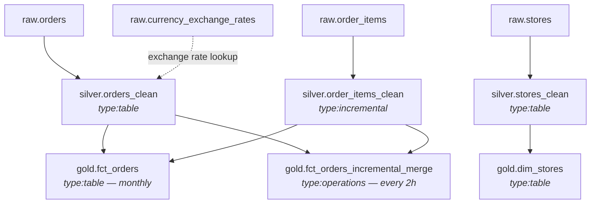

# Architecture

## Layers

```
raw       →   silver         →   gold
(CDC)         (clean,             (business-grade,
              type-safe,           materialized,
              deduplicated)        consumption-ready)
```

Each layer has a single responsibility. Cross-layer leakage (a gold table reading from raw, a silver table embedding business logic) is treated as a code smell.

| Layer | Owns | Does NOT own |
|---|---|---|
| `raw` | Source schema, CDC metadata, duplicates, late arrivals | Type safety, business rules |
| `silver` | Deduplication (`ROW_NUMBER`), `SAFE_CAST`, USD enrichment | Aggregations, business labels |
| `gold` | Business rules, denormalized fact tables, derived attributes | Source-schema cleanup, dedup logic |

## DAG (resolved by Dataform)



There is no separate `airflow_dag.py`. Every arrow above is implied by a `${ref()}` somewhere in the SQLX. Dataform compiles the graph at build time.

## Workflow configurations

Two scheduled workflows are defined in production:

| Workflow | Cron | Tags executed | Purpose |
|---|---|---|---|
| `main-pipeline-2h` | `0 */2 * * *` | `silver`, `gold`, `incremental` | Hot-path: keep gold within 2h of source |
| `monthly-refresh` | `0 2 1 * *` | `monthly_refresh` | Full-refresh of `fct_orders` as a drift safeguard |

The dual-pipeline approach (incremental MERGE + monthly full refresh) is **deliberate redundancy**, not a mistake. See [`docs/incremental-strategy.md`](incremental-strategy.md) for the rationale.

## Partitioning and clustering decisions

| Table | Partition | Cluster | Why |
|---|---|---|---|
| `silver.orders_clean` | `DATE(created_at)` | `store_id, customer_id` | Most queries are time-bounded by date and grouped by store |
| `silver.order_items_clean` | `DATE(created_at)` | `order_id` | Joined back to orders by order_id frequently |
| `silver.stores_clean` | _(none — low volume)_ | `country_code, store_id` | Small dimension; cluster aids country-scoped queries |
| `gold.fct_orders` | `DATE(created_at)` | `store_id, customer_id` | Mirrors silver to keep joins partition-aligned |
| `gold.fct_orders_incremental_merge` | `DATE(created_at)` | `store_id, customer_id` | Same as above — merges into the same physical layout |
| `gold.dim_stores` | _(none)_ | `country_code, store_id` | Same rationale as silver.stores_clean |

The principle: **partition on the column that bounds queries; cluster on the columns that filter or join within partitions.** Don't over-cluster — BigQuery only honors the first ~4 clustering columns and silently drops the rest.
